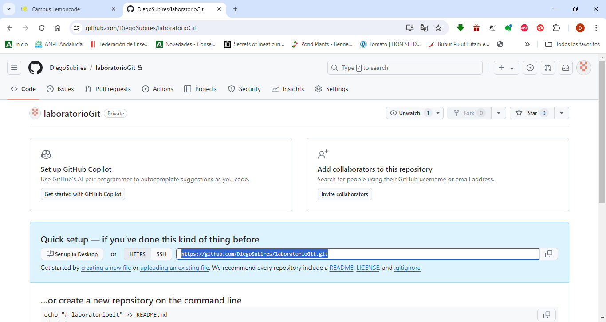

# Laboratorio Git

## 1. Crear un repositorio en local

## 2. Subir el repositorio a GitHub

## 3. Hacer un commit y un push

## 4. Crear una rama

## 5. Hacer un merge

https://github.com/DiegoSubires/laboratorioGit.git